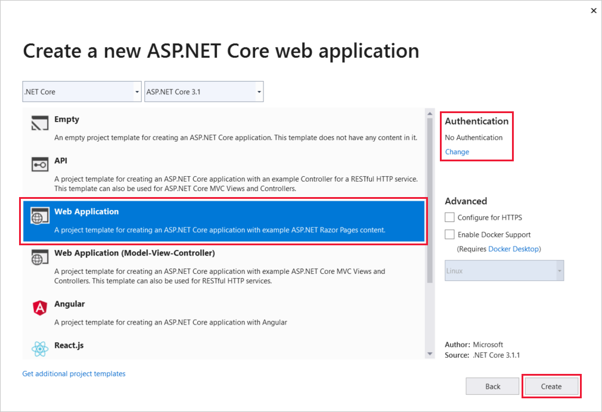
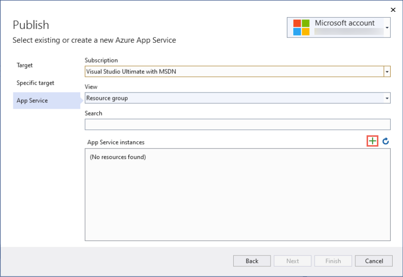
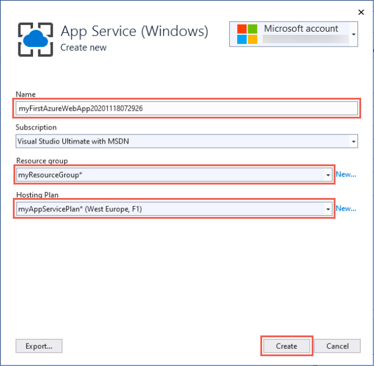
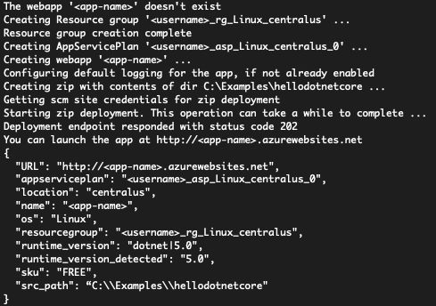

# Quickstart: Create an ASP.NET Core web app in Azure

::: zone pivot="platform-windows"  

In this quickstart, you'll learn how to create and deploy your first ASP.NET Core web app to [Azure App Service](overview.md). App Service supports .NET 5.0 apps.

When you're finished, you'll have an Azure resource group consisting of an App Service hosting plan and an App Service with a deployed web application.

## Prerequisites

- An Azure account with an active subscription. [Create an account for free](https://azure.microsoft.com/free/dotnet/).
- Install <a href="https://www.visualstudio.com/downloads/" target="_blank">Visual Studio 2019</a> with the **ASP.NET and web development** workload.

  If you've installed Visual Studio 2019 already:

  - Install the latest updates in Visual Studio by selecting **Help** > **Check for Updates**. The latest updates contain the .NET 5.0 SDK.
  - Add the workload by selecting **Tools** > **Get Tools and Features**.


## Create an ASP.NET Core web app

Create an ASP.NET Core web app in Visual Studio by following these steps:

# [.NET Core 3.1](#tab/netcore31)

1. Open Visual Studio and select **Create a new project**.

1. In **Create a new project**, select **ASP.NET Core Web Application** and confirm that **C#** is listed in the languages for that choice, then select **Next**.

1. In **Configure your new project**, name your web application project *myFirstAzureWebApp*, and select **Create**.

   

1. You can deploy any type of ASP.NET Core web app to Azure, but for this quickstart, choose the **Web Application** template. Make sure **Authentication** is set to **No Authentication**, and that no other option is selected. Then, select **Create**.

    
   
1. From the Visual Studio menu, select **Debug** > **Start Without Debugging** to run your web app locally.

   

# [.NET 5.0](#tab/net50)

1. Open Visual Studio and select **Create a new project**.

1. In **Create a new project**, select **ASP.NET Core Web Application** and confirm that **C#** is listed in the languages for that choice, then select **Next**.

1. In **Configure your new project**, name your web application project *myFirstAzureWebApp*, and select **Create**.

   

1. For a .NET 5.0 app, select **ASP.NET Core 5.0** in the dropdown.

1. You can deploy any type of ASP.NET Core web app to Azure, but for this quickstart, choose the **ASP.NET Core Web App** template. Make sure **Authentication** is set to **No Authentication**, and that no other option is selected. Then, select **Create**.

    
   
1. From the Visual Studio menu, select **Debug** > **Start Without Debugging** to run your web app locally.

   

---

## Publish your web app

To publish your web app, you must first create and configure a new App Service that you can publish your app to. 

As part of setting up the App Service, you'll create:

- A new [resource group](../azure-resource-manager/management/overview.md#terminology) to contain all of the Azure resources for the service.
- A new [Hosting Plan](./overview-hosting-plans.md) that specifies the location, size, and features of the web server farm that hosts your app.

Follow these steps to create your App Service and publish your web app:

1. In **Solution Explorer**, right-click the **myFirstAzureWebApp** project and select **Publish**. 

1. In **Publish**, select **Azure** and click **Next**.

1. Your options depend on whether you're signed in to Azure already and whether you have a Visual Studio account linked to an Azure account. Select either **Add an account** or **Sign in** to sign in to your Azure subscription. If you're already signed in, select the account you want.

   

1. To the right of **App Service instances**, click **+**.

   

1. For **Subscription**, accept the subscription that is listed or select a new one from the drop-down list.

1. For **Resource group**, select **New**. In **New resource group name**, enter *myResourceGroup* and select **OK**. 

1. For **Hosting Plan**, select **New**. 

1. In the **Hosting Plan: Create new** dialog, enter the values specified in the following table:

   | Setting  | Suggested Value | Description |
   | -------- | --------------- | ----------- |
   | **Hosting Plan**  | *myFirstAzureWebAppPlan* | Name of the App Service plan. |
   | **Location**      | *West Europe* | The datacenter where the web app is hosted. |
   | **Size**          | *Free* | [Pricing tier](https://azure.microsoft.com/pricing/details/app-service/?ref=microsoft.com&utm_source=microsoft.com&utm_medium=docs&utm_campaign=visualstudio) determines hosting features. |
   
   

1. In **Name**, enter a unique app name that includes only the valid characters are `a-z`, `A-Z`, `0-9`, and `-`. You can accept the automatically generated unique name. The URL of the web app is `http://<app-name>.azurewebsites.net`, where `<app-name>` is your app name.

2. Select **Create** to create the Azure resources.

   

   Once the wizard completes, the Azure resources are created for you and you are ready to publish.

3. Select **Finish** to close the wizard.

1. In the **Publish** page, click **Publish**. Visual Studio builds, packages, and publishes the app to Azure, and then launches the app in the default browser.

   

**Congratulations!** Your ASP.NET Core web app is running live in Azure App Service.

## Update the app and redeploy

Follow these steps to update and redeploy your web app:

1. In **Solution Explorer**, under your project, open **Pages** > **Index.cshtml**.

1. Replace the entire `<div>` tag with the following code:

   ```html
   <div class="jumbotron">
       <h1>ASP.NET in Azure!</h1>
       <p class="lead">This is a simple app that we've built that demonstrates how to deploy a .NET app to Azure App Service.</p>
   </div>
   ```

1. To redeploy to Azure, right-click the **myFirstAzureWebApp** project in **Solution Explorer** and select **Publish**.

1. In the **Publish** summary page, select **Publish**.

   <!--  -->

    When publishing completes, Visual Studio launches a browser to the URL of the web app.

    

## Manage the Azure app

To manage your web app, go to the [Azure portal](https://portal.azure.com), and search for and select **App Services**.


On the **App Services** page, select the name of your web app.

:::image type="content" source="./media/quickstart-dotnetcore/select-app-service.png" alt-text="Screenshot of the App Services page with an example web app selected.":::

The **Overview** page for your web app, contains options for basic management like browse, stop, start, restart, and delete. The left menu provides further pages for configuring your app.


[!INCLUDE [Clean-up section](../../includes/clean-up-section-portal.md)]

## Next steps

In this quickstart, you used Visual Studio to create and deploy an ASP.NET Core web app to Azure App Service.

Advance to the next article to learn how to create a .NET Core app and connect it to a SQL Database:

> [!div class="nextstepaction"]
> [ASP.NET Core with SQL Database](tutorial-dotnetcore-sqldb-app.md)

> [!div class="nextstepaction"]
> [Configure ASP.NET Core app](configure-language-dotnetcore.md)

::: zone-end  

::: zone pivot="platform-linux"
[App Service on Linux](overview.md#app-service-on-linux) provides a highly scalable, self-patching web hosting service using the Linux operating system. This quickstart shows how to create a [.NET Core](/aspnet/core/) app and deploy to a Linux hosted App Service using the [Azure CLI](/cli/azure/get-started-with-azure-cli).


You can follow the steps in this article using a Mac, Windows, or Linux machine.

[!INCLUDE [quickstarts-free-trial-note](../../includes/quickstarts-free-trial-note.md)]

## Set up your initial environment

# [.NET Core 3.1](#tab/netcore31)

To complete this quickstart:

* <a href="https://dotnet.microsoft.com/download/dotnet-core/3.1" target="_blank">Install the latest .NET Core 3.1 SDK</a>.
* <a href="/cli/azure/install-azure-cli" target="_blank">Install the latest Azure CLI</a>.

# [.NET 5.0](#tab/net50)

To complete this quickstart:

* <a href="https://dotnet.microsoft.com/download/dotnet/5.0" target="_blank">Install the latest .NET 5.0 SDK</a>.
* <a href="/cli/azure/install-azure-cli" target="_blank">Install the latest Azure CLI</a>.

---

[Having issues? Let us know.](https://aka.ms/DotNetAppServiceLinuxQuickStart)

## Create the app locally

In a terminal window on your machine, create a directory named `hellodotnetcore` and change the current directory to it.

```bash
mkdir hellodotnetcore
cd hellodotnetcore
```

Create a new .NET Core app.

```bash
dotnet new web
```

## Run the app locally

Run the application locally so that you see how it should look when you deploy it to Azure. 

```bash
dotnet run
```

Open a web browser, and navigate to the app at `http://localhost:5000`.

You see the **Hello World** message from the sample app displayed in the page.


[Having issues? Let us know.](https://aka.ms/DotNetAppServiceLinuxQuickStart)

## Sign into Azure
In your terminal window, log into Azure with the following command:

```azurecli
az login
```

## Deploy the app

Deploy the code in your local folder (*hellodotnetcore*) using the `az webapp up` command:

```azurecli
az webapp up --sku F1 --name <app-name> --os-type linux
```

- If the `az` command isn't recognized, be sure you have the Azure CLI installed as described in [Set up your initial environment](#set-up-your-initial-environment).
- Replace `<app-name>` with a name that's unique across all of Azure (*valid characters are `a-z`, `0-9`, and `-`*). A good pattern is to use a combination of your company name and an app identifier.
- The `--sku F1` argument creates the web app on the Free pricing tier. Omit this argument to use a faster premium tier, which incurs an hourly cost.
- You can optionally include the argument `--location <location-name>` where `<location-name>` is an available Azure region. You can retrieve a list of allowable regions for your Azure account by running the [`az account list-locations`](/cli/azure/appservice#az-appservice-list-locations) command.

The command may take a few minutes to complete. While running, it provides messages about creating the resource group, the App Service plan and hosting app, configuring logging, then performing ZIP deployment. It then gives the message, "You can launch the app at http://&lt;app-name&gt;.azurewebsites.net", which is the app's URL on Azure.

# [.NET Core 3.1](#tab/netcore31)


# [.NET 5.0](#tab/net50)

<!-- Deploy the code in your local folder (*hellodotnetcore*) using the `az webapp up` command:

```azurecli
az webapp up --sku B1 --name <app-name> --os-type linux
```

- If the `az` command isn't recognized, be sure you have the Azure CLI installed as described in [Set up your initial environment](#set-up-your-initial-environment).
- Replace `<app-name>` with a name that's unique across all of Azure (*valid characters are `a-z`, `0-9`, and `-`*). A good pattern is to use a combination of your company name and an app identifier.
- The `--sku B1` argument creates the web app in the Basic pricing tier, which incurs an hourly cost. Omit this argument to use a faster premium tier, which costs more.
- You can optionally include the argument `--location <location-name>` where `<location-name>` is an available Azure region. You can retrieve a list of allowable regions for your Azure account by running the [`az account list-locations`](/cli/azure/appservice#az-appservice-list-locations) command.

The command may take a few minutes to complete. While running, it provides messages about creating the resource group, the App Service plan and hosting app, configuring logging, then performing ZIP deployment. It then gives the message, "You can launch the app at http://&lt;app-name&gt;.azurewebsites.net", which is the app's URL on Azure. -->



---

[Having issues? Let us know.](https://aka.ms/DotNetAppServiceLinuxQuickStart)

[!include [az webapp up command note](../../includes/app-service-web-az-webapp-up-note.md)]

## Browse to the app

Browse to the deployed application using your web browser.

```bash
http://<app_name>.azurewebsites.net
```

The .NET Core sample code is running in App Service on Linux with a built-in image.


**Congratulations!** You've deployed your first .NET Core app to App Service on Linux.

[Having issues? Let us know.](https://aka.ms/DotNetAppServiceLinuxQuickStart)

## Update and redeploy the code

In the local directory, open the _Startup.cs_ file. Make a small change to the text in the method call `context.Response.WriteAsync`:

```csharp
await context.Response.WriteAsync("Hello Azure!");
```

Save your changes, then redeploy the app using the `az webapp up` command again:

```azurecli
az webapp up --os-type linux
```

This command uses values that are cached locally in the *.azure/config* file, including the app name, resource group, and App Service plan.

Once deployment has completed, switch back to the browser window that opened in the **Browse to the app** step, and hit refresh.


[Having issues? Let us know.](https://aka.ms/DotNetAppServiceLinuxQuickStart)

## Manage your new Azure app

Go to the <a href="https://portal.azure.com" target="_blank">Azure portal</a> to manage the app you created.

From the left menu, click **App Services**, and then click the name of your Azure app.

:::image type="content" source="./media/quickstart-dotnetcore/portal-app-service-list-up.png" alt-text="Screenshot of the App Services page showing an example Azure app selected.":::

You see your app's Overview page. Here, you can perform basic management tasks like browse, stop, start, restart, and delete. 


The left menu provides different pages for configuring your app. 

[!INCLUDE [cli-samples-clean-up](../../includes/cli-samples-clean-up.md)]

[Having issues? Let us know.](https://aka.ms/DotNetAppServiceLinuxQuickStart)

## Next steps

> [!div class="nextstepaction"]
> [Tutorial: ASP.NET Core app with SQL Database](tutorial-dotnetcore-sqldb-app.md)

> [!div class="nextstepaction"]
> [Configure ASP.NET Core app](configure-language-dotnetcore.md)

::: zone-end
