# Advanced features of the Azure metrics explorer

> [!NOTE]
> This article assumes you're familiar with basic features of the Azure metrics explorer feature of Azure Monitor. If you're a new user and want to learn how to create your first metric chart, see [Getting started with the metrics explorer](./metrics-getting-started.md).

In Azure Monitor, [metrics](data-platform-metrics.md) are a series of measured values and counts that are collected and stored over time. Metrics can be standard (also called "platform") or custom. 

Standard metrics are provided by the Azure platform. They reflect the health and usage statistics of your Azure resources. 

## Resource scope picker
The resource scope picker allows you to view metrics across single resources and multiple resources. The following sections explain how to use the resource scope picker. 

### Select a single resource
Select **Metrics** from the **Azure Monitor** menu or from the **Monitoring** section of a resource's menu. Then choose **Select a scope** to open the scope picker. 

Use the scope picker to select the resources whose metrics you want to see. The scope should be populated if you opened the Azure metrics explorer from a resource's menu. 

For some resources, you can view only one resource's metrics at a time. In the **Resource types** menu, these resources are in the **All resource types** section.

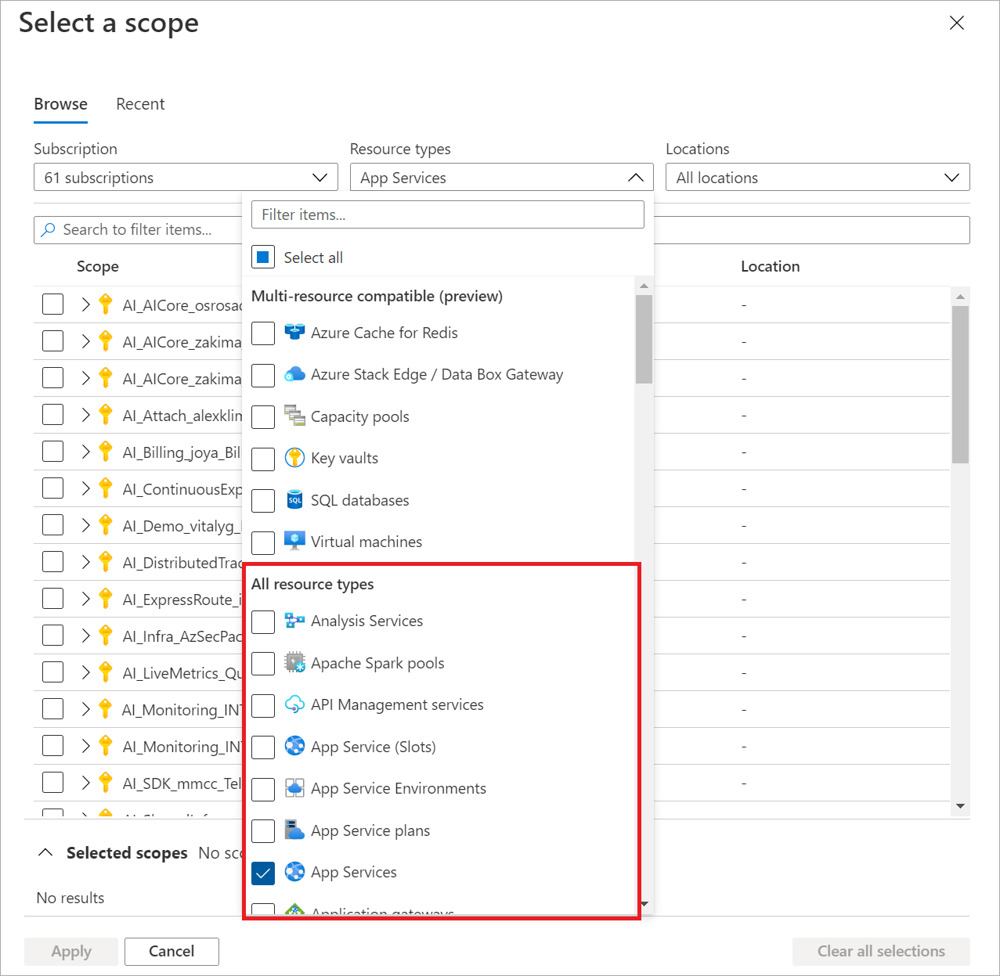

After selecting a resource, you see all subscriptions and resource groups that contain that resource.

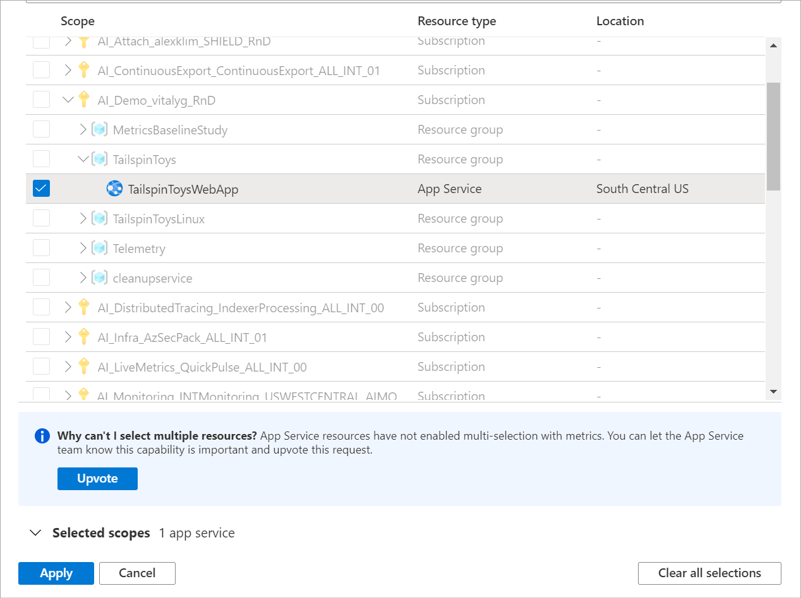

> [!TIP]
> If you want the capability to view the metrics for multiple resources at the same time, or to view metrics across a subscription or resource group, select **Upvote**.

When you're satisfied with your selection, select **Apply**.

### View metrics across multiple resources
Some resource types can query for metrics over multiple resources. The resources must be within the same subscription and location. Find these resource types at the top of the **Resource types** menu. 

For more information, see [Select multiple resources](./metrics-dynamic-scope.md#select-multiple-resources).

For types that are compatible with multiple resources, you can query for metrics across a subscription or multiple resource groups. For more information, see [Select a resource group or subscription](./metrics-dynamic-scope.md#select-a-resource-group-or-subscription).

## Multiple metric lines and charts

In the Azure metrics explorer, you can create charts that plot multiple metric lines or show multiple metric charts at the same time. This functionality allows you to:

- Correlate related metrics on the same graph to see how one value relates to another.
- Display metrics that use different units of measure in close proximity.
- Visually aggregate and compare metrics from multiple resources.

For example, imagine you have five storage accounts, and you want to know how much space they consume together. You can create a (stacked) area chart that shows the individual values and the sum of all the values at particular points in time.

### Multiple metrics on the same chart

To view multiple metrics on the same chart, first [create a new chart](./metrics-getting-started.md#create-your-first-metric-chart). Then select **Add metric**. Repeat this step to add another metric on the same chart.

> [!NOTE]
> Typically, your charts shouldn't mix metrics that use different units of measure. For example, avoid mixing one metric that uses milliseconds with another that uses kilobytes. Also avoid mixing metrics whose scales differ significantly. 
>
> In these cases, consider using multiple charts instead. In the metrics explorer, select **Add chart** to create a new chart.

### Multiple charts

To create another chart that uses a different metric, select **Add chart**.

To reorder or delete multiple charts, select the ellipsis (**...**) button to open the chart menu. Then choose **Move up**, **Move down**, or **Delete**.

## Aggregation

When you add a metric to a chart, the metrics explorer automatically applies a default aggregation. The default makes sense in basic scenarios. But you can use a different aggregation to gain more insights about the metric. 

Before you use different aggregations on a chart, you should understand how the metrics explorer handles them. Metrics are a series of measurements (or "metric values") that are captured over a time period. When you plot a chart, the values of the selected metric are separately aggregated over the *time grain*. 

You select the size of the time grain by using the metrics explorer's [time picker panel](./metrics-getting-started.md#select-a-time-range). If you don't explicitly select the time grain, the currently selected time range is used by default. After the time grain is determined, the metric values that were captured during each time grain are aggregated on the chart, one data point per time grain.

For example, suppose a chart shows the *Server response time* metric. It uses the *average* aggregation over time span of the *last 24 hours*. In this example:

- If the time granularity is set to 30 minutes, the chart is drawn from 48 aggregated data points. That is, the line chart connects 48 dots in the chart plot area (24 hours x 2 data points per hour). Each data point represents the *average* of all captured response times for server requests that occurred during each of the relevant 30-minute time periods.
- If you switch the time granularity to 15 minutes, you get 96 aggregated data points.  That is, you get 24 hours x 4 data points per hour.

The metrics explorer has five basic statistical aggregation types: sum, count, min, max, and average. The *sum* aggregation is sometimes called the *total* aggregation. For many metrics, the metrics explorer hides the aggregations that are irrelevant and can't be used.

* **Sum**: The sum of all values captured during the aggregation interval.

    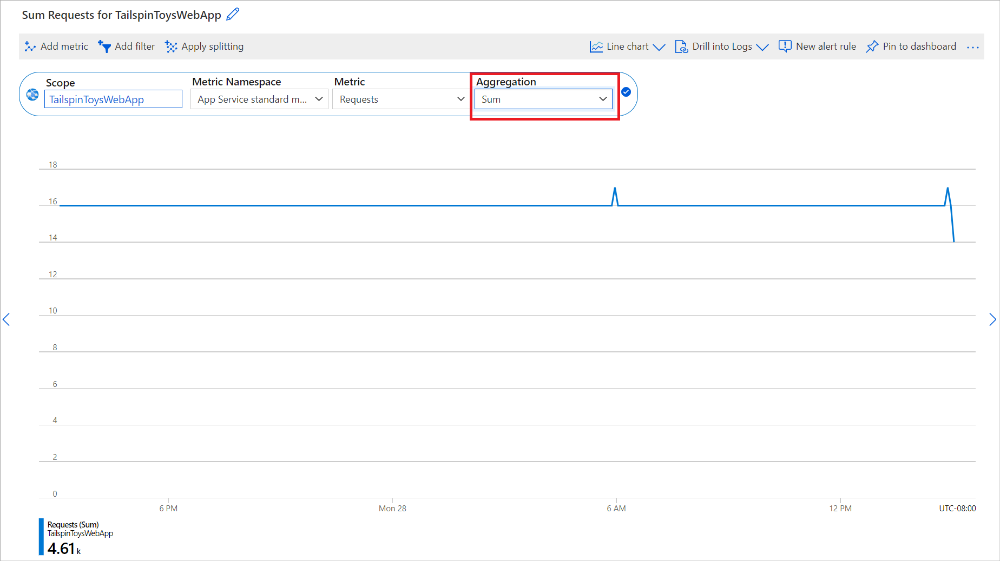

* **Count**: The number of measurements captured during the aggregation interval. 
    
    When the metric is always captured with the value of 1, the count aggregation is equal to the sum aggregation. This scenario is common when the metric tracks the count of distinct events and each measurement represents one event. The code emits a metric record every time a new request arrives.

    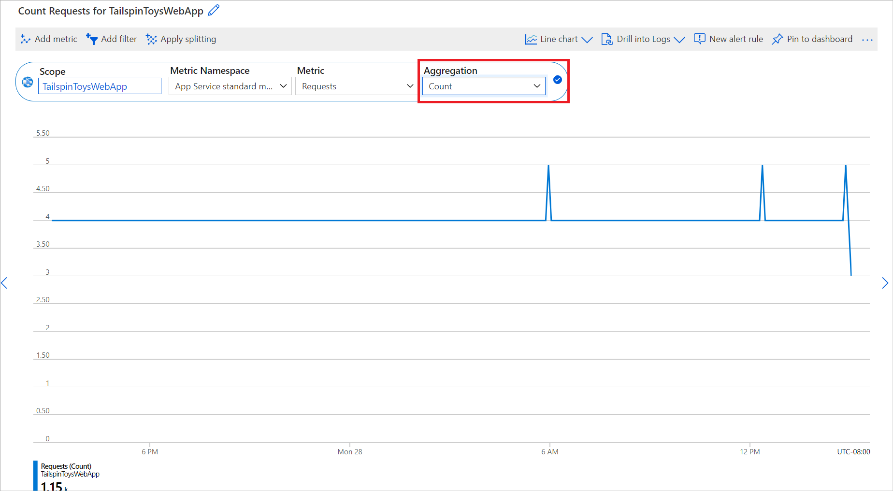

* **Average**: The average of the metric values captured during the aggregation interval.

    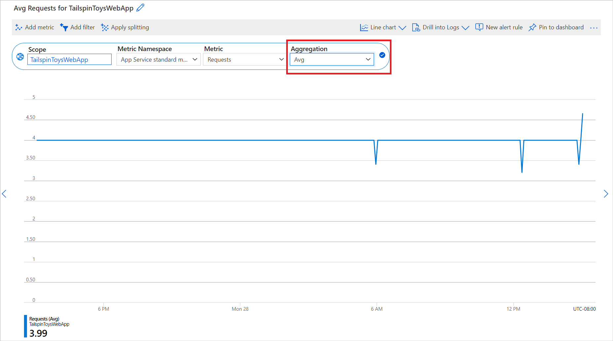

* **Min**: The smallest value captured during the aggregation interval.

    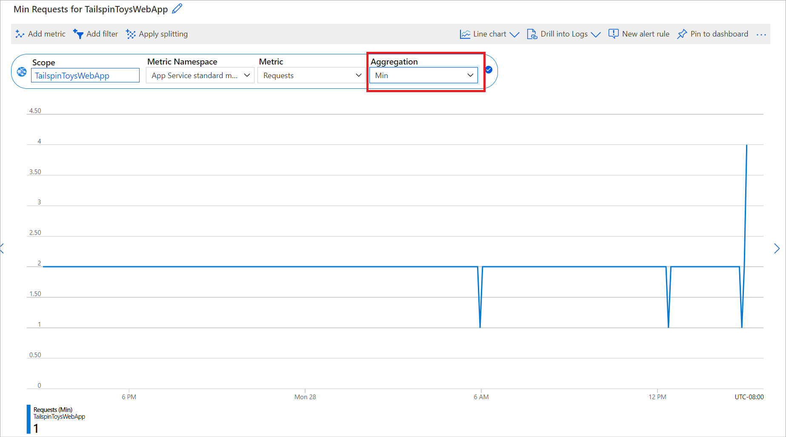

* **Max**: The largest value captured during the aggregation interval.

    

## Filters

You can apply filters to charts whose metrics have dimensions. For example, imagine a "Transaction count" metric that has a "Response type" dimension. This dimension indicates whether the response from transactions succeeded or failed. If you filter on this dimension, you'll see a chart line for only successful (or only failed) transactions. 

### Add a filter

1. Above the chart, select **Add filter**.

2. Select a dimension (property) to filter.

   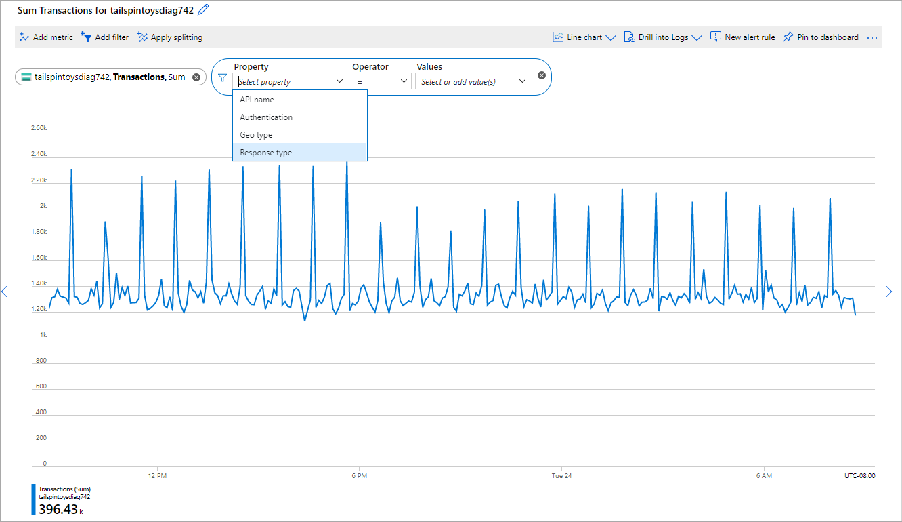

3. Select the operator you want to apply against the dimension (property). The default operator is = (equals)

   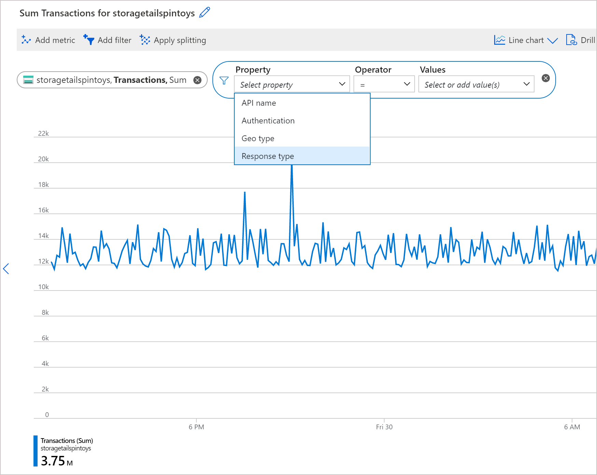

4. Select which dimension values you want to apply to the filter when plotting the chart (this example shows filtering out the successful storage transactions):

   

5. After selecting the filter values, click away from the Filter Selector to close it. Now the chart shows how many storage transactions have failed:

   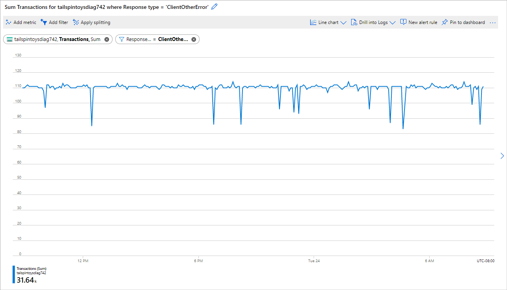

6. You can repeat steps 1-5 to apply multiple filters to the same charts.

## Metric splitting

You can split a metric by dimension to visualize how different segments of the metric compare. Splitting can also help you identify the outlying segments of a dimension.

### Apply splitting

1. Above the chart, select **Apply splitting**.
 
   > [!NOTE]
   > Charts that have multiple metrics can't use the splitting functionality. Also, although a chart can have multiple filters, it can have only one splitting dimension.

2. Choose a dimension on which to segment your chart:

   

   The chart now shows multiple lines, one for each dimension segment:

   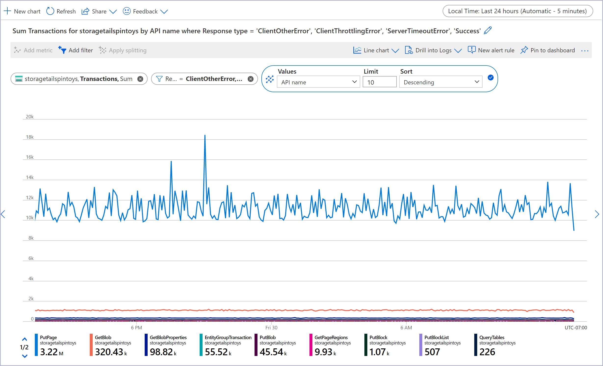
   
3. Choose a limit on the number of values to be displayed after splitting by selected dimension. The default limit is 10 as shown in the above chart. The range of limit is 1 - 50.
   
   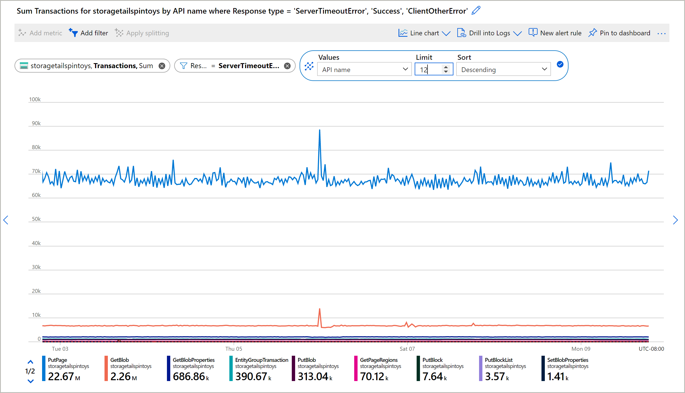
   
4. Choose the sort order on segments: Ascending or Descending. The default selection is descending.
   
   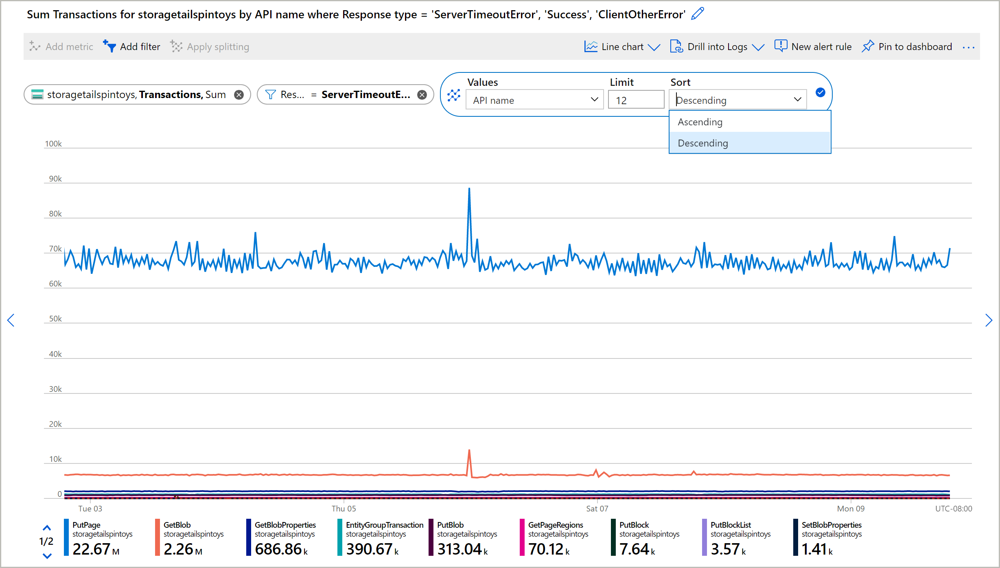

5. Click away from the **Grouping Selector** to close it.
   

   > [!NOTE]
   > To hide segments that are irrelevant for your scenario and to make your charts easier to read, use both filtering and splitting on the same dimension.

## Locking the range of the y-axis

Locking the range of the value (y) axis becomes important in charts that show small fluctuations of large values. 

For example, a drop in the volume of successful requests from 99.99 percent to 99.5 percent might represent a significant reduction in the quality of service. But noticing a small numeric value fluctuation would be difficult or even impossible if you're using the default chart settings. In this case, you could lock the lowest boundary of the chart to 99 percent to make a small drop more apparent. 

Another example is a fluctuation in the available memory. In this scenario, the value will technically never reach 0. Fixing the range to a higher value might make drops in available memory easier to spot. 

To control the y-axis range, open the chart menu (**...**). Then select **Chart settings** to access advanced chart settings.

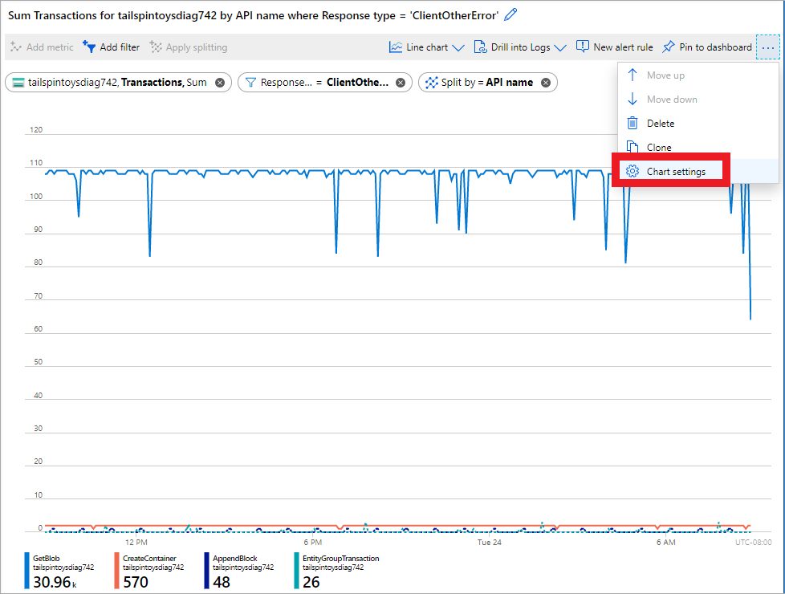

Modify the values in the **Y-axis range** section, or select **Auto** to revert to the default values.
 
 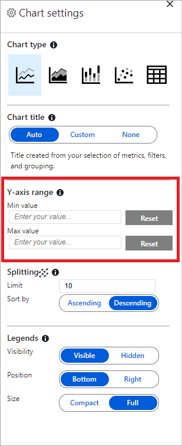

> [!WARNING]
> If you need to lock the boundaries of the y-axis for charts that track counts or sums over a period of time (by using count, sum, min, or max aggregations), you should usually specify a fixed time granularity. In this case, you shouldn't rely on the automatic defaults. 
>
> You choose a fixed time granularity because chart values change when the time granularity is automatically modified after a user resizes a browser window or changes screen resolution. The resulting change in time granularity affects the look of the chart, invalidating the current selection of the y-axis range.

## Line colors

After you configure the charts, the chart lines are automatically assigned a color from a default palette. You can change those colors.

To change the color of a chart line, select the colored bar in the legend that corresponds to the chart. The color picker dialog box opens. Use the color picker to configure the line color.

Your customized colors are preserved when you pin the chart to a dashboard. The following section shows how to pin a chart.

## Pinning to dashboards 

After you configure a chart, you might want to add it to a dashboard. By pinning a chart to a dashboard, you can make it accessible to your team. You can also gain insights by viewing it in the context of other monitoring telemetry.

To pin a configured chart to a dashboard, in the upper-right corner of the chart, select **Pin to dashboard**.

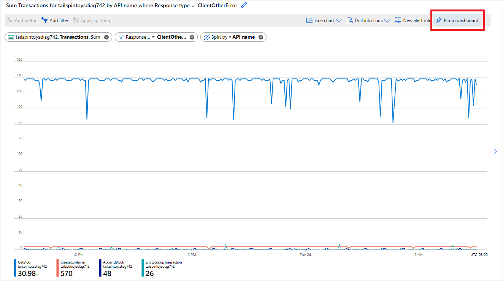

## Alert rules

You can use your visualization criteria to create a metric-based alert rule. The new alert rule will include your chart's target resource, metric, splitting, and filter dimensions. You can modify these settings by using the alert rule creation pane.

To begin, select **New alert rule**.

The alert rule creation pane opens. In the pane, you see the chart's metric dimensions. The fields in the pane are prepopulated to help you customize the rule.

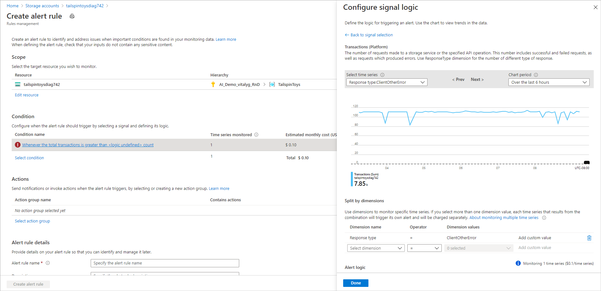

For more information, see [Create, view, and manage metric alerts](../alerts/alerts-metric.md).

## Troubleshooting

If you don't see any data on your chart, review the following troubleshooting information:

* Filters apply to all of the charts on the pane. While you focus on a chart, make sure that you don't set a filter that excludes all the data on another chart.

* To set different filters on different charts, create the charts in different blades. Then save the charts as separate favorites. If you want, you can pin the charts to the dashboard so you can see them together.

* If you segment a chart by a property that the metric doesn't define, the chart displays no content. Try clearing the segmentation (splitting), or choose a different property.

## Next steps

To create actionable dashboards by using metrics, see [Creating custom KPI dashboards](../app/tutorial-app-dashboards.md).

